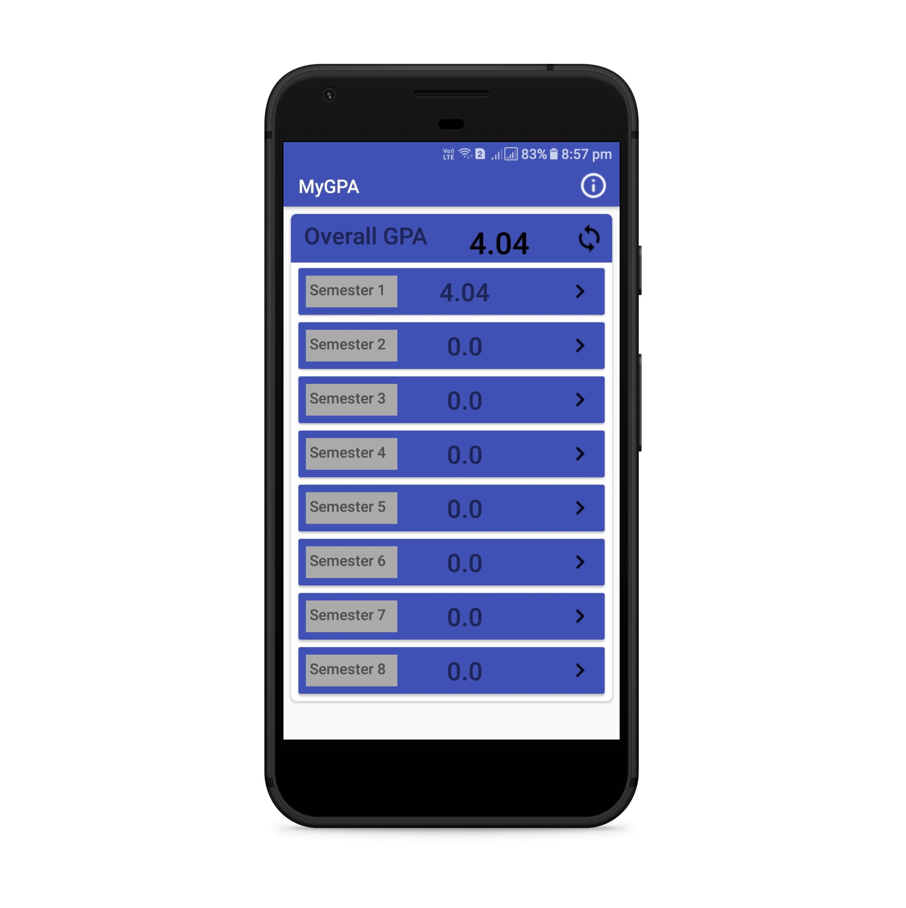
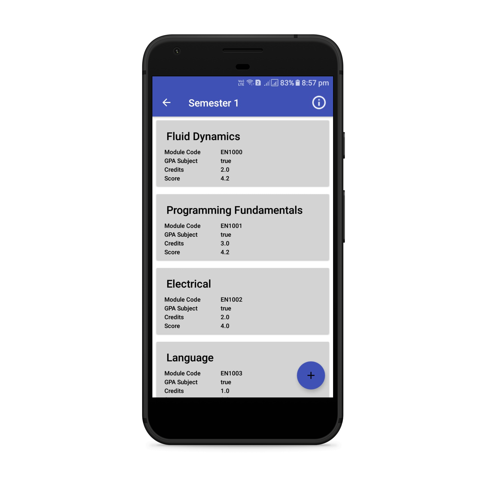
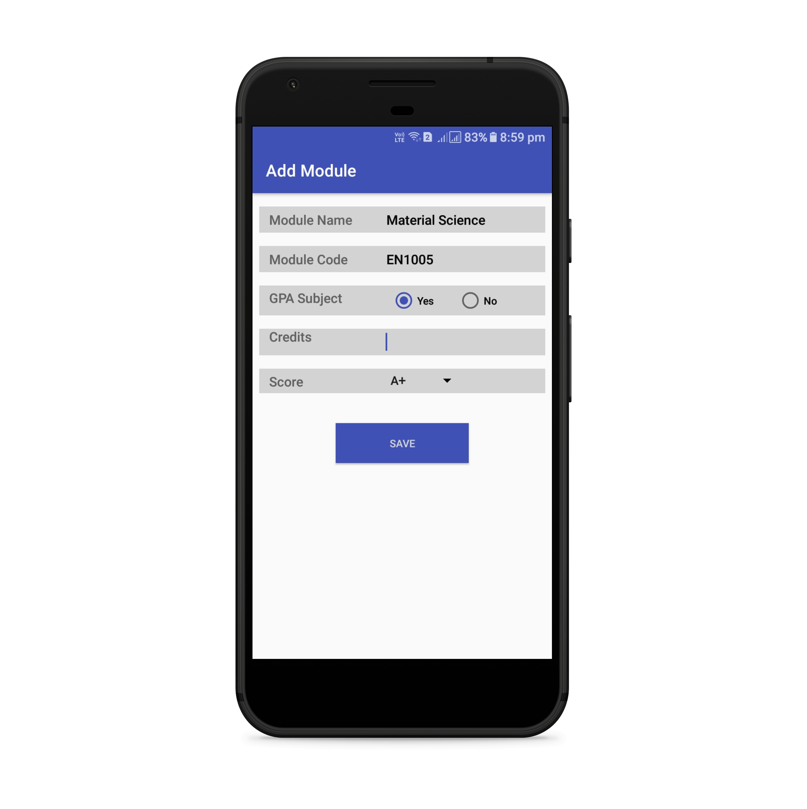
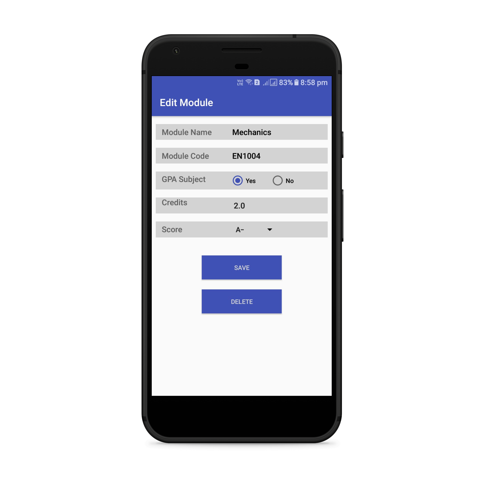

# MyGPA
Android Application for calculating GPA...

## Find the latest release

[View App on Playstore](https://play.google.com/store/apps/details?id=isumalab.entc)

## What is MyGPA?

MyGPA app is for making everyone's GPA smart.

## Features

1. Calculates Overall GPA, SGPAs
2. Adding modules
3. Editting modules
4. Searching modules - parked

## Screenshots

## Gist

Look at this to findout what modules have been entered to the database.
If you need developer team to add new modules to the database request using the given template to info.isumalab@gmail.com

[View Gist](https://gist.github.com/isurunuwanthilaka/170fa5a1defae9d10d244a339ea196e2)

## Contact

Drop a mail to info.isumalab@gmail.com
